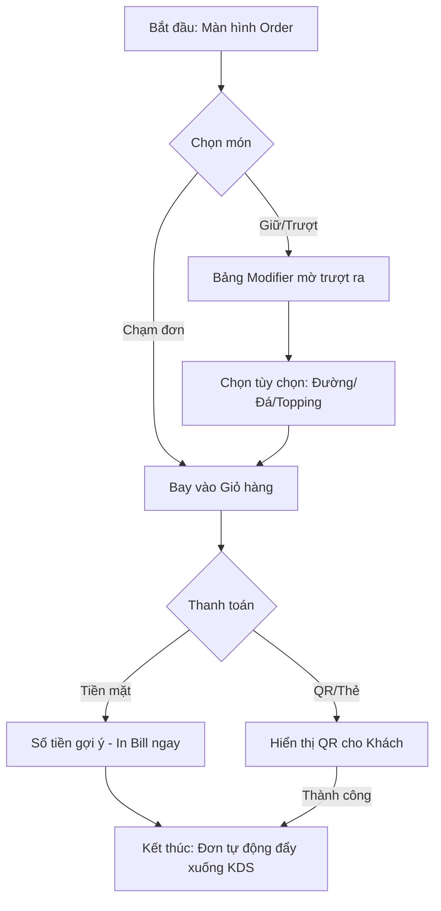
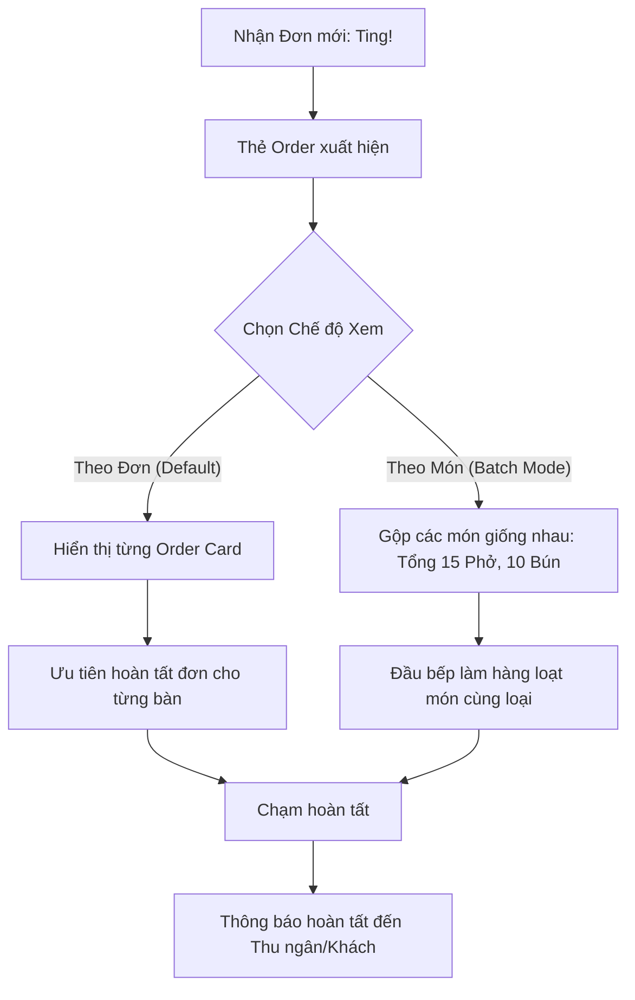
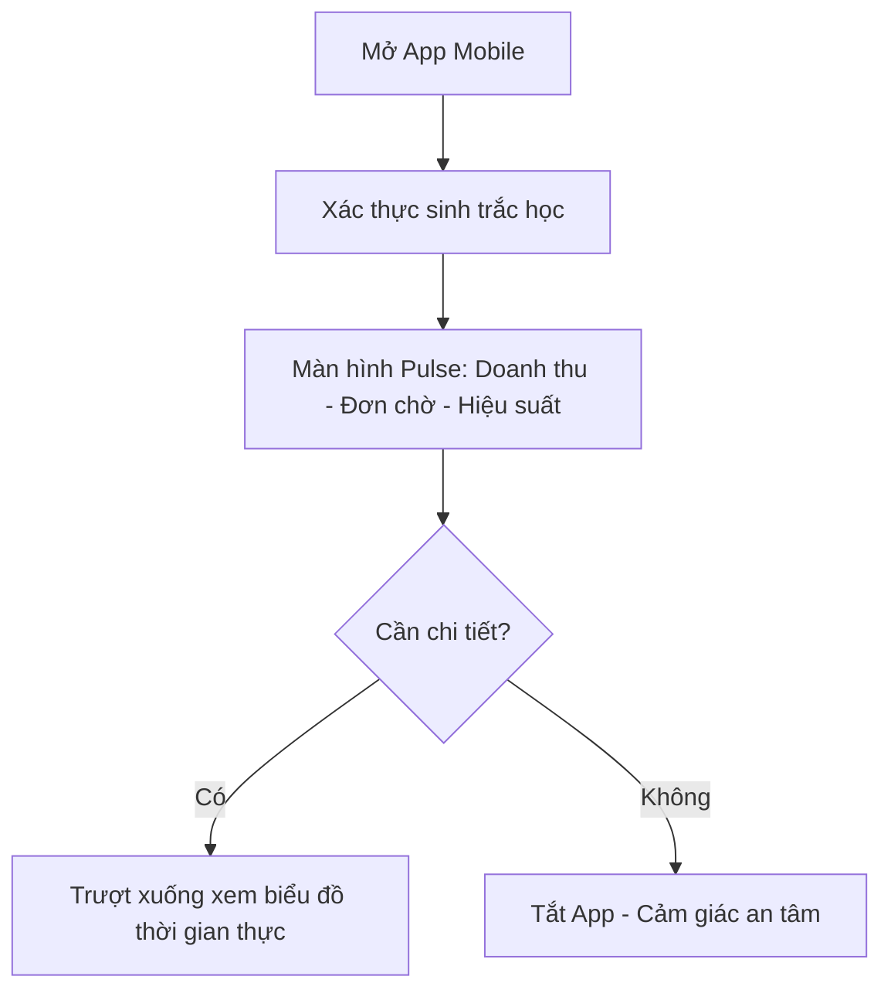
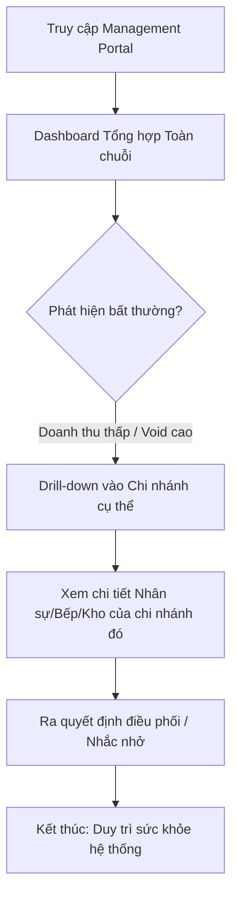

# UX Design Specification pos-sdd

**Author:** Tuan.nguyen
**Date:** 2026-03-14

---

## Executive Summary

### Project Vision

pos-sdd là hệ thống quản lý điểm bán hàng (POS) thế hệ mới được thiết kế như một trung tâm điều khiển thời gian thực cho chuỗi F&B và bán lẻ. Tầm nhìn cốt lõi là tạo ra một dòng chảy giao dịch liền mạch từ Nhận order (Thu ngân) → Chế biến (Bếp) → Ra quyết định (Quản lý), qua đó tối đa hóa thông lượng phục vụ, giảm thiểu tỷ lệ sai sót về 0 và hỗ trợ khả năng mở rộng chuỗi mạnh mẽ.

### Target Users

1. **Thu ngân (Cashier):** Người trực tiếp thao tác tại quầy dưới áp lực cao. Cần một giao diện tối giản, tối ưu cho tốc độ và ít thao tác nhất (≤ 5 click cho mỗi order).
2. **Nhân viên Bếp/Pha chế (Kitchen/Bar Staff):** Làm việc trong môi trường nóng bức, nhịp độ nhanh. Cần giao diện KDS (Kitchen Display System) nổi bật với màu sắc chỉ báo mức độ ưu tiên, đếm ngược thời gian rõ ràng tránh bỏ sót báo đơn.
3. **Cửa hàng trưởng (Store Manager):** Cần hệ thống thông báo sự cố tức thời và cung cấp bảng điều khiển (Dashboard) mang lại "nhận thức kinh doanh trong 30 giây" (30-second business awareness).
4. **Chủ chuỗi (Owner):** Cần số liệu tổng hợp đa chi nhánh, thời gian thực để chống gian lận và tối ưu vận hành.

### Key Design Challenges

- **Tối ưu hóa Tốc độ Tối đa (Extreme Speed):** Giao diện Thu ngân phải được tinh chỉnh từng pixel, loại bỏ mọi màn hình thừa để đảm bảo 1 vòng lặp order hoàn thành trong 10-15 giây.
- **Trải nghiệm Ngoại tuyến Mượt mà (Offline UX Resilience):** Thiết kế chỉ báo trạng thái (status indicators) rõ ràng khi mất mạng mà không làm gián đoạn luồng công việc hiện tại của thu ngân, đảm bảo họ vẫn tự tin in bill bình thường.
- **Tối ưu Khả năng Hiển thị cho KDS:** Không gian bếp nhiều dầu mỡ, tiếng ồn và ánh sáng phức tạp đòi hỏi các thẻ hiển thị (tickets) trên màn hình KDS phải có phông chữ cực lớn, độ tương phản cao và phân loại trạng thái bằng biểu tượng/màu sắc dễ nhìn từ xa.

### Design Opportunities

- **Trải nghiệm POS "Vô hình" (Invisible POS):** Sử dụng các giá trị mặc định thông minh (smart defaults) và tự động gộp các sửa đổi (auto-modifiers) để hệ thống như "đọc được suy nghĩ" của thu ngân, tạo ra "Aha Moment" ngay lần dùng đầu.
- **Biến KDS thành Vạch Nhịp Tim (Heartbeat Monitor):** Thiết kế lại hoàn toàn khái niệm bếp truyền thống bằng hàng đợi thị giác sinh động, loại bỏ hoàn toàn hóa đơn giấy, giúp bếp làm việc nhịp nhàng như một dàn nhạc.
- **Mobile-first Dashboard Hành động:** Bảng điều khiển cho quản lý không chỉ là các biểu đồ khô khan, mà là các thông điệp kêu gọi hành động (Call-to-actions) khẩn cấp ngay trên điện thoại di động khi có biến động (VD: Cảnh báo hàng chờ đang quá dài).

## Core User Experience

### Defining Experience

Trải nghiệm cốt lõi của pos-sdd là **"Dòng chảy giao dịch Không gián đoạn" (Uninterrupted Transaction Flow)**. Mọi thao tác từ lúc khách đọc món đến lúc hoàn tất thanh toán phải diễn ra trong một nhịp điệu liên tục, không có độ trễ hệ thống, không có bước xác nhận thừa. Hành động quan trọng nhất là màn hình Order (Tạo đơn hàng) - nơi thu ngân dành 90% thời gian làm việc.

### Platform Strategy

- **Dashboard & Back-Office (Manager/Owner):** Desktop-first Web Portal cho quản trị hệ thống và Mobile-first App cho báo cáo nhanh. Ưu tiên trình bày dữ liệu dạng bảng biểu (Data Grid) và biểu đồ xu hướng (Trend Charts).
- **POS Thu ngân (Cashier):** Ưu tiên nền tảng Web App chạy trên Tablet/Desktop cảm ứng (Touch-first). Bắt buộc hỗ trợ Offline-mode.
- **KDS Nhà bếp (Kitchen):** Màn hình hiển thị ngang (Landscape) trên Smart TV hoặc Tablet lớn.

### Effortless Interactions

- **Sửa đổi món (Zero-friction Modifiers):** Thêm topping, chọn size, ghi chú... diễn ra ngay trên cùng một màn hình mà không cần mở popup che khuất tầm nhìn đơn hàng.
- **Tập hợp thông minh (Smart Grouping):** KDS tự động gom nhóm các món ăn giống nhau từ nhiều bàn khác nhau để bếp chế biến cùng lúc.
- **Thanh toán chớp nhoáng (One-tap Payment):** Tự động điền số tiền khách phải trả, mặc định chọn phương thức thanh toán phổ biến nhất (QR/Tiền mặt) để hoàn tất chỉ với 1 điểm chạm.

### Critical Success Moments

- **Khoảnh khắc "Sóng gió" (Peak Hour Resilience):** Thu ngân xử lý 5 khách liên tục trong vòng 1 phút mà không cảm thấy hệ thống bị chậm lại hay giật lag.
- **Khoảnh khắc "Mất mạng" (Offline Survival):** Khi rớt mạng Internet, hệ thống âm thầm chuyển sang trạng thái Offline (hiển thị icon nhỏ) mà không cản trở thao tác hiện tại. Thu ngân vẫn in bill bình thường.
- **Khoảnh khắc "Nhìn thấu" (30-second Clarity):** Quản lý mở app trên điện thoại đang đi trên xe và ngay lập tức biết được cửa hàng nào đang quá tải hàng chờ.

### Experience Principles

- **Speed Over Everything (Tốc độ là trên hết):** Mọi pixel trên màn hình Thu ngân phải phục vụ việc giảm số lượt click và thời gian đọc hiểu.
- **Resilience by Design (Bền bỉ từ trong lõi):** Người dùng không bao giờ phải chịu hậu quả của lỗi kết nối mạng.
- **Visual Hierarchy for Action (Phân cấp thị giác để hành động):** Tại KDS và Dashboard, màu sắc rực rỡ (Đỏ/Vàng) chỉ dùng cho các trạng thái cần hành động KHẨN CẤP (như món làm quá lâu, hết nguyên liệu).

## Desired Emotional Response

### Primary Emotional Goals

Mục tiêu cảm xúc cốt lõi của pos-sdd là mang lại sự **Tự tin (Confidence)** và **Kiểm soát (Control)**.
- **Đối với Thu ngân:** Cảm giác "Mình đang làm chủ tốc độ của cửa hàng". Không còn nỗi sợ hãi mỗi khi dòng khách xếp hàng dài, vì họ biết hệ thống sẽ phản hồi nhanh hơn cả tay họ bấm.
- **Đối với Bếp:** Cảm giác "Mọi thứ rõ ràng và trong tầm kiểm soát". Không còn sự hoảng loạn vì mất bill hay nhầm thứ tự ưu tiên.
- **Đối với Quản lý:** Cảm giác "Bình yên trong tâm trí" (Peace of mind). Họ có thể rời khỏi cửa hàng mà vẫn cảm thấy an tâm vì biết mọi thứ đang diễn ra thế nào.

### Emotional Journey Mapping

- **Khi mới Onboarding:** *Ngạc nhiên (Surprise) → An tâm (Relief).* "Ôi, hóa ra nó dễ dùng đến vậy, không cần học gì nhiều."
- **Trong giờ cao điểm (Core action):** *Tập trung (Flow state) → Trao quyền (Empowered).* Thao tác như một cỗ máy mượt mà, cảm thấy mình làm việc rất năng suất.
- **Khi sự cố xảy ra (Rớt mạng):** *Thoáng lo lắng (Brief anxiety) → Nhẹ nhõm (Relief).* Khi thấy mạng rớt nhưng vẫn order và in bill được bình thường, họ sẽ hoàn toàn tin tưởng vào hệ thống.
- **Kết thúc ca làm việc:** *Thỏa mãn (Satisfied).* Tổng kết tiền mặt và báo cáo khớp 100% một cách nhanh chóng.

### Micro-Emotions

- **Tin tưởng (Trust) thay vì Hoài nghi (Skepticism):** Bếp tin tưởng hoàn toàn vào màn hình KDS thay vì phải chạy ra hỏi lại thu ngân.
- **Tự hào (Accomplishment) thay vì Bực bội (Frustration):** Thu ngân xử lý xong 1 order phức tạp (nhiều sửa đổi) trong 10 giây.
- **Bình tĩnh (Calmness) thay vì Hốt hoảng (Panic):** Quản lý nhận cảnh báo sự cố từ Dashboard và xử lý ngay trước khi nó trở thành thảm họa.

### Design Implications

- **Để hỗ trợ sự Tự tin (Confidence):** Sử dụng các nút bấm (Hitbox) cực lớn, màu sắc phân biệt rõ ràng (Xanh = Xong/Tiếp tục, Đỏ = Hủy/Sai). Giao diện tối giản loại bỏ mọi thông tin thừa gây phân tâm.
- **Để hỗ trợ sự Bình tĩnh (Calmness):** Âm thanh báo hiệu (Sound UI) đóng vai trò quan trọng, đặc biệt trong Bếp. Không dùng các âm thanh gây chói tai hay réo rắt. Âm thanh báo đơn mới phải dứt khoát nhưng dễ chịu.
- **Để hỗ trợ sự Tin tưởng (Trust):** Mọi thao tác lưu, thanh toán, hay rớt mạng phải có chỉ báo trạng thái UI (tiến trình, icon offline) xuất hiện ngay trong 0.1 giây.

### Emotional Design Principles

- **Predictability is Peace (Sự có thể đoán trước là Sự bình yên):** Hệ thống phải phản ứng theo cùng một cách, thời gian phản hồi bằng nhau trong mọi tình huống (dù khách đang vắng hay đông).
- **Silent Reliability (Sự đáng tin cậy thầm lặng):** Chế độ Offline hay các luồng đồng bộ diễn ra hoàn toàn "trong suốt" với người dùng, không bao giờ lấy đi quyền kiểm soát khỏi tay họ.

## UX Pattern Analysis & Inspiration

### Inspiring Products Analysis

- **Apple POS (Giao diện Thu ngân tại Apple Store):** Không dùng quầy thu ngân truyền thống. Nhân viên dùng thiết bị di động với màn hình cảm ứng tối giản. Điểm xuất sắc là **tính cơ động (Mobility)** và **Thanh toán chớp nhoáng (Instant Checkout)** với thẻ từ/Apple Pay, loại bỏ hoàn toàn phần cứng cồng kềnh.
- **KFC / McDonald's KDS (Hệ thống điều phối Bếp):** Đặc trưng bởi các khối order dạng thẻ (Cards) đổi màu theo thời gian (Xanh -> Vàng -> Đỏ). Giao diện không có chi tiết thừa, phông chữ khổng lồ. Mọi nhân viên bếp chỉ cần liếc qua là biết phải làm gì tiếp theo.
- **Shopify POS / Toast POS:** Giao diện cho phép tuỳ biến menu lưới (Grid Menu), có Dark Mode thân thiện. Khả năng gộp món (smart modifier) rất trực quan, giúp thu ngân xử lý hàng loạt tùy biến mà không bị nhầm lẫn.
- **Uber Eats Manager App:** Dashboard trên di động cực kỳ hiệu quả trong việc cảnh báo vấn đề (tiếng chuông to rõ, thông báo nhấp nháy đỏ khi có rắc rối xảy ra tại nhà hàng).

### Transferable UX Patterns

**1. Mẫu Giao diện Tốc độ (Speed-first Overlay Patterns cho Thu ngân)**
- Thay vì mở cửa sổ mới (New window) hoặc chuyển trang, ta sẽ sử dụng Sliding Panels (mở khay từ cạnh phải) hoặc Bottom Sheets để thêm Ghi chú/Topings. Điều này giữ nguyên ngữ cảnh của giỏ hàng hiện tại.

**2. Mẫu Hàng đợi Thị giác (Visual Queue Patterns cho KDS)**
- Kanban-style Board: KDS được chia thành các cột rõ ràng (Chờ làm -> Đang làm -> Xong).
- Auto-Progressive Color Coding: Card tự động chuyển màu từ Xanh lá (Bình thường) -> Vàng (Cảnh báo thời gian) -> Đỏ thẫm (Quá tải, trễ giờ) kèm theo độ co giật/nhấp nháy tinh tế.

**3. Mẫu Cảnh báo Chủ động (Proactive Notification Patterns cho Quản lý)**
- Empty State thông minh: Dashboard hiển thị trạng thái "Tất cả ổn (All Good)" với một màu xanh thư giãn khi không có sự cố, thay vì nhồi nhét biểu đồ phức tạp mà không có ý nghĩa cảnh báo.

### Anti-Patterns to Avoid

- **The Endless Popup (Pop-up Vô tận):** Ở nhiều hệ thống POS cũ, thêm 1 ly trà đá phải bấm qua 3 cái popup (Chọn đá -> Chọn đường -> Xác nhận). Điều này giết chết tốc độ.
- **Text-heavy KDS (Bếp nhiều Chữ):** Nhồi nhét tên món bằng chữ quá dài mà không dùng biểu tượng hoặc viết tắt (M, L, XL), khiến bếp tốn thời gian "đọc" thay vì "nhìn thấy".
- **Invisible Loading (Tải không trạng thái):** Khi mạng chậm hoặc mất mạng, màn hình đứng yên không phản hồi (frezee) khiến Thu ngân bấm liên tục vào 1 nút thanh toán, dẫn đến việc in ra 3-4 cái bill giống rệt nhau.

### Design Inspiration Strategy

**What to Adopt (Những gì cần áp dụng ngay):**
- **Color-coded urgency:** Học hỏi McDonald's KDS: Màu sắc là thông điệp.
- **Sliding Panels cho Modifiers:** Học hỏi Toast POS: Không bao giờ che mất đơn hàng đang hiển thị.

**What to Adapt (Những gì cần điều chỉnh):**
- **Dashboard App:** Học hỏi Uber Eats, nhưng tinh giản biểu đồ phân tích sâu. Tập trung vào 3 dòng chữ to nhất: Doanh thu hiện tại, Số lượng bill đang kẹt, Món đang hết.

**What to Avoid (Những gì phải tránh xa):**
- Tránh xa thiết kế "Click-to-confirm" (Bấm để xác nhận) cho thao tác thường xuyên. Với thao tác bình thường, lấy chính hành động dứt khoát làm xác nhận (VD: Vuốt để thanh toán, thay vì Bấm nút Thanh toán -> Bạn có chắc không?).

## Design System Foundation

### 1.1 Design System Choice

Hệ thống thiết kế được lựa chọn cho pos-sdd là **Tailwind CSS kết hợp với Shadcn UI (hoặc Radix UI Primitives)**.
Đây là phương pháp tiếp cận theo hướng "Themeable System" kết hợp với các component không giao diện (headless components) để đảm bảo tối đa hóa quyền kiểm soát giao diện người dùng.

### Rationale for Selection

- **Tối ưu Tốc độ Phát triển (Speed of Development):** Tailwind + Shadcn cung cấp sẵn các mẫu UI hiện đại, giúp ghép nối layout quản lý (Dashboard) hoặc giao diện Thu ngân cực nhanh mà không phải viết CSS từ đầu.
- **Tùy biến Sâu sắc (Deep Customization):** Khác with Material Design hay Ant Design (nơi component bị khóa cứng trong một phong cách nhất định), Shadcn UI cấp quyền sở hữu hoàn toàn mã nguồn component. Điều này tối quan trọng khi thiết kế màn hình Thu ngân và KDS - nơi chúng ta cần làm các nút bấm to bất thường, loại bỏ padding thừa hoặc custom màu sắc cảnh báo theo thời gian thực.
- **Hiệu suất & Khối lượng cực nhẹ (Performance & Bundle Size):** Tailwind chỉ biên dịch các class được sử dụng, giúp ứng dụng Web tải cực nhanh, hỗ trợ tuyệt vời cho yêu cầu hoạt động mượt mà trong môi trường mạng yếu hoặc rớt mạng (Offline-mode).
- **Khả năng tiếp cận (Accessibility):** Radix UI (nền tảng của Shadcn) xử lý tự động toàn bộ logic về bàn phím (keyboard navigation) và focus. Điều này quan trọng vì thu ngân đôi khi thao tác kết hợp cả phím tắt cơ cứng.

### Implementation Approach

- Sử dụng Next.js / React làm Framework chính để dễ ứng dụng hệ thống này.
- **Global Tokens:** Định nghĩa lại toàn bộ hệ màu ngữ nghĩa (Semantic colors) qua biến CSS của Tailwind. Ví dụ thay vì dùng `bg-red-500`, sẽ dùng `bg-alert-critical` (dành cho KDS khi quá giờ).
- **Typography:** Lựa chọn bộ phông chữ San Serif có tính dễ đọc cao (như Inter hoặc Roboto), tập trung tạo ra thang kích cỡ chữ (typography scale) đặc biệt lớn cho màn hình KDS.

### Customization Strategy

- **POS Cashier View (Thu ngân):** Ghi đè (Override) các Component mặc định của Shadcn UI như Button, Modal để tăng kích thước Hitbox (vùng chạm) lên 20-30% so với độ lớn tiêu chuẩn của Web thông thường (tối ưu cho màn hình cảm ứng).
- **KDS View (Khối nhà bếp):** Tự xây dựng (Custom build) các thẻ Order Card vì đây là component đặc thù không có sẵn trong các bộ UI Kit thông thường. Định nghĩa các màu sắc nền để phục vụ `Auto-Progressive Color Coding`.
- **Manager Dashboard:** Sử dụng 90% Component mặc định từ Shadcn (Cards, Tables, Charts) để tiết kiệm thời gian, chỉ chỉnh sửa màu sắc (Theme color) cho khớp với bộ nhận diện chung.

## 2. Core User Experience

### 2.1 Defining Experience

Khoảnh khắc định nghĩa của pos-sdd là **"Chạm một lần - Đơn xuống Bếp" (One-Touch Kitchen Sync)**. 
Nếu Tinder có "Vuốt để làm quen", thì pos-sdd có "Bấm chọn món - In bill - Đẩy đơn qua Bếp" diễn ra như một phản ứng dây chuyền tự động, không có màn hình trung gian, không có popup xác nhận. Mục tiêu là biến POS thành một "phần mở rộng của đôi tay" thu ngân.

### 2.2 User Mental Model

- **Mô hình hiện tại:** Thu ngân thường nghĩ về POS như một cái "máy tính tính tiền" chậm chạp và phức tạp. Họ luôn mong đợi sự cố xảy ra (treo máy, mất mạng) và phải chuẩn bị sẵn sổ tay ghi chép.
- **Mô hình pos-sdd:** Biến POS thành một "bàn phím nhạc cụ". Thu ngân không cần "nghĩ", họ chỉ cần "cảm nhận". Mọi hành động chọn món phải hiển thị kết quả ngay lập tức (Immediate visual feedback). 
- **Kỳ vọng:** Người dùng kỳ vọng sự dứt khoát. Nếu bấm "Thanh toán", họ kỳ vọng máy in bill sẽ kêu ngay sau 0.5 giây.

### 2.3 Success Criteria

- **Tốc độ phản hồi (Latency):** Mọi tương tác chạm phải phản hồi trong < 100ms.
- **Tỷ lệ sai sót:** Thu ngân có khả năng sửa đổi/hủy món trong < 2 giây nếu khách đổi ý, giúp họ luôn cảm thấy mình làm chủ tình hình.
- **Chỉ báo thành công:** Âm thanh "Ting" từ KDS báo hiệu đơn đã xuống bếp là bằng chứng rõ nhất cho sự thành công của một chu kỳ order.
- **Độ tin cậy 100%:** Ngay cả khi offline, người dùng không nhận thấy bất kỳ sự khác biệt nào về hiệu suất giao diện.

### 2.4 Novel UX Patterns

pos-sdd kết hợp các mẫu thiết kế quen thuộc với các cải tiến mới:
- **Zero-Confirm Workflow (Luồng Không xác nhận):** Loại bỏ nút "Xác nhận món" (Confirm item). Khi chạm vào món, món tự động bay vào giỏ hàng. Muốn bỏ món, chỉ cần vuốt sang phải.
- **Contextual Sliding (Trượt ngữ cảnh):** Thay vì mở màn hình mới cho Modifier (chọn đường/đá), một bảng nhỏ sẽ trượt ra ngay dưới món ăn đó, giữ nguyên sự tập trung cho Thu ngân.
- **Heat-map KDS:** Các thẻ order trên màn hình bếp sẽ "nóng lên" (đậm màu dần) dựa trên thời gian thực, giúp nhân viên bếp ưu tiên bằng trực giác mà không cần đọc số phút.

### 2.5 Experience Mechanics

**1. Khởi đầu (Initiation):**
- Thu ngân mở màn hình Order, hệ thống đã sẵn sàng ở bàn/khách mới mặc định.
- Danh mục món ăn phổ biến nhất (Best-sellers) luôn hiển thị đầu tiên.

**2. Tương tác (Interaction):**
- **Chạm:** Chọn món.
- **Giữ/Trượt:** Mở tùy chọn nâng cao (modifiers).
- **Thanh toán:** Hệ thống gợi ý số tiền khách thường đưa (nếu dùng tiền mặt) hoặc hiển thị QR động ngay màn hình phụ.

**3. Phản hồi (Feedback):**
- Hiệu ứng thị giác món ăn "bay" vào giỏ hàng.
- Rung phản hồi (Haptic feedback) nếu dùng trên Tablet.
- Icon mạng (Online/Offline) luôn hiển thị trạng thái xanh/xám thầm lặng ở góc.

**4. Hoàn tất (Completion):**
- Bill in ra ngay lập tức.
- Giỏ hàng được làm trống tự động và chuyển sang đơn tiếp theo trong 0.1 giây.
- KDS của bếp vang lên âm thanh báo đơn mới.

## Visual Design Foundation

### Color System

Hệ thống màu sắc của pos-sdd được thiết kế để tối ưu hóa khả năng đọc trong môi trường nhà hàng có ánh sáng phức tạp và giảm mỏi mắt cho nhân viên làm việc ca dài.

- **Primary Color (Xanh Brand):** Sử dụng Xanh Indigo đậm (#1E293B) làm màu chủ đạo, tạo cảm giác về một hệ thống công nghệ hiện đại, ổn định và đáng tin cậy.
- **Background Strategy:** Áp dụng giao diện tối (Dark Mode) làm chủ đạo cho các màn hình vận hành (Thu ngân, KDS) để làm nổi bật các trạng thái quan trọng.
- **Semantic Colors (Màu ngữ nghĩa):**
    - **Success (#10B981 - Emerald):** Sử dụng cho trạng thái hoàn tất đơn, in hóa đơn thành công.
    - **Warning (#F59E0B - Amber):** Sử dụng cho các đơn hàng sắp quá hạn chế biến (cảnh báo tại KDS).
    - **Critical (#EF4444 - Red):** Sử dụng cho thông báo lỗi máy in, hủy món, hoặc các sự cố vận hành khẩn cấp.
- **Neutral Palette:** Các sắc độ xám (Slate) được tinh chỉnh để phân cấp các vùng thông tin phụ, giúp mắt người dùng tập trung vào các nút hành động chính.

### Typography System

- **Typeface:** Sử dụng phông chữ **Inter** (một phông Sans-serif hiện đại, mã nguồn mở, độ đọc cực cao).
- **Hierarchy (Phân cấp):**
    - **Headings (H1, H2):** Sử dụng cho tên món ăn lớn tại KDS hoặc tổng tiền trên Bill để dễ nhìn từ xa.
    - **Body (Medium/Regular):** Sử dụng cho danh sách đơn hàng và thông tin chi tiết. 
    - **UI Labels (Bold):** Sử dụng cho các nút bấm hành động khẩn cấp để tăng tốc độ nhận diện.
- **Accessibility:** Đảm bảo độ tương phản màu chữ so với nền luôn đạt chuẩn WCAG 2.1 AA để hỗ trợ người dùng có thị lực kém hoặc trong điều kiện chói sáng.

### Spacing & Layout Foundation

- **Spacing Scale:** Sử dụng hệ thống lưới 8px (base unit) làm quy chuẩn cho mọi khoảng cách, ensure tính cân đối tuyệt đối trên mọi loại màn hình từ máy tính bảng đến TV.
- **Density (Mật độ):**
    - **Thu ngân:** Mật độ cao (Compact) để tối đa số lượng món ăn hiển thị trên một màn hình nhằm giảm thiểu thao tác cuộn.
    - **KDS:** Mật độ thấp (Spacious) với các khối thông tin lớn, dễ dàng nhận diện trạng thái chỉ với một cái liếc mắt.
- **Grid System:** Cấu trúc 12 cột linh hoạt để thích ứng tốt với mọi độ phân giải màn hình.

### Accessibility Considerations

- **Hitbox Optimization:** Toàn bộ các vùng tương tác (nút bấm, thẻ món ăn) được nới rộng vùng nhận cảm ứng (tối thiểu 44x44px) để tránh bấm nhầm cho nhân viên đang vội.
- **Status Indicators:** Không chỉ dùng màu sắc, các thông báo lỗi hoặc cảnh báo sẽ đi kèm với biểu tượng (Icon) dứt khoát để hỗ trợ người dùng bị mù màu.

## Design Direction Decision

### Design Directions Explored

Chúng ta đã khám phá 3 hướng thiết kế chính:
1. **The Command Center:** Dark mode sâu, tập trung vào sự ổn định trong môi trường thiếu sáng.
2. **The Modern Bistro:** Giao diện sáng, sử dụng hiệu ứng Glassmorphism và bo góc mềm mại, tối ưu cho Tablet.
3. **The Speed Engine:** Tối giản tối đa, tập trung vào mật độ lưới (grid density) để đạt tốc độ cao nhất.

### Chosen Direction

Hướng được lựa chọn là **Direction 2: The Modern Bistro**. 

### Design Rationale

- **Sự thiện cảm và Hiện đại:** Light mode kết hợp với bảng màu Slate & Teal mang lại cảm giác sạch sẽ, cao cấp cho không gian nhà hàng/quán cafe.
- **Tối ưu hóa Tablet:** Các hiệu ứng đổ bóng nhẹ và bo góc lớn (16px+) giúp các vùng tương tác trở nên rõ ràng và dễ dàng thao tác bằng tay.
- **Hiệu ứng Glassmorphism:** Việc sử dụng các lớp mờ giúp phân cấp giao diện một cách tinh tế mà không làm người dùng cảm thấy nặng nề về mặt thị giác.

### Implementation Approach

- **Theme:** Triển khai biến thể "Light" trong Tailwind CSS với hệ màu Slate làm nền và Emerald/Teal làm điểm nhấn.
- **Components:** Sử dụng các Shadcn UI components với thuộc tính `rounded-2xl` để khớp với ngôn ngữ thiết kế Bistro.
- **Visual Effects:** Ứng dụng `backdrop-blur` cho các thanh điều hướng và bảng phụ (panels) để duy trì sự mượt mà.

## User Journey Flows

### 1. Cashier: The "Snap-Order" Flow
Mục tiêu: Hoàn tất một đơn hàng phức tạp trong chưa đầy 30 giây.

### 2. Kitchen: The Hybrid View Production
Mục tiêu: Đa dạng hóa cách xử lý đơn (theo Đơn hàng hoặc theo Món ăn) để tối ưu hiệu suất giờ cao điểm.

### 3. Manager: The "Pulse" Dashboard
Mục tiêu: Cung cấp 3 con số quan trọng nhất trong 3 giây.

### 4. Chain Owner: The "Intelligence" Journey
Mục tiêu: Nhận diện bất thường toàn chuỗi và ra quyết định can thiệp từ xa trong 60 giây.

### Journey Patterns & Flow Optimization Principles
- **Pattern: Progressive Disclosure (Tiết lộ dần):** Chỉ hiện Modifier khi cần, giữ màn hình chính luôn sạch sẽ.
- **Pattern: Drill-down Pattern:** Cho phép đi từ số liệu tổng quát (Chuỗi) xuống chi tiết (Món ăn/Nhân viên) mà không làm mất phương hướng.
- **Pattern: View-State Toggle:** Nút chuyển đổi chế độ xem KDS (Order/Item) nằm ở vị trí dễ chạm nhất.
- **Optimization: Zero-latency Feedback:** Món ăn "bay" vào giỏ hàng ngay lập tức để thu ngân không phải đợi hệ thống xác nhận.
- **Optimization: Predictive Batching:** Khi ở chế độ xem món, hệ thống tự động làm nổi bật các món có số lượng lớn đang chờ để đầu bếp ưu tiên.

## Component Strategy

### Design System Components

Dựa trên nền tảng **Shadcn UI**, chúng ta sẽ kế thừa các thành phần nguyên tử (atomic components) để đảm bảo tính nhất quán:
- **Navigation:** Tabs cho danh mục món ăn tham chiếu nhanh.
- **Overlays:** Modals (Dialog) cho các thiết lập hệ thống, Popovers cho các thông báo nhanh.
- **Forms:** Inputs và Selects cho việc quản lý hồ sơ khách hàng.
- **Feedback:** Toasts cho các thông báo in bill thành công hoặc lỗi hệ thống.

### Custom Components

Để đạt được trải nghiệm "Modern Bistro" đặc thù, chúng ta cần thiết kế các thành phần tùy chỉnh sau:

#### 1. Snap-Order Card (Cashier)
*   **Mục đích:** Giúp thu ngân chọn món trong < 100ms.
*   **Giải phẫu:** Ảnh nền mờ (Visual cue), Giá ở góc trên, Tên món ở dưới, Badge số lượng (nổi bật nếu > 1).
*   **Tương tác:** Chạm là "bay" vào giỏ hàng ngay.

#### 2. KDS Ticket (Hybrid)
*   **Mục đích:** Hiển thị dữ liệu đơn hàng cho đầu bếp, hỗ trợ đa chế độ xem.
*   **Trạng thái:** New (Ting!), In Progress (Màu Teal nhạt), Warning (>10p, Màu Cam), Overdue (Màu Đỏ nháy nhẹ).
*   **Tương tác:** Chạm để chọn món, Toggle để chuyển sang chế độ "Item/Batch View".

#### 3. Contextual Action Sheet (Item-level)
*   **Mục đích:** Chứa các lệnh cấp món mà không làm mất ngữ cảnh giỏ hàng.
*   **Kích hoạt:** Chạm giữ (Long press) hoặc Vuốt trái trên món ăn trong giỏ hàng.
*   **Chức năng:** Hủy món (Màu đỏ), Giảm giá món (🏷️), Ghi chú (📝).

#### 4. Global Order Toolbar (Order-level)
*   **Mục đích:** Quản lý các lệnh cấp đơn hàng tại khu vực Giỏ hàng.
*   **Chức năng:** Chọn khách hàng (👤), Gộp/Tách bàn (🔄), Giảm giá toàn đơn (💰).
*   **Tương tác:** Sử dụng mẫu "Kéo & Thả" (Drag & Drop) cho thao tác gộp bàn trực quan trên sơ đồ.

#### 5. Visual Floor Plan (Map View)
*   **Mục đích:** Trung tâm điều phối bàn tập trung cho Thu ngân và Quản lý.
*   **Chức năng:** Phân khu (Zoning), điều hướng tầng, thu phóng sơ đồ.
*   **Tương tác:** Kéo thả để gộp bàn, chạm giữ để xem nhanh (Peek Tooltip).

#### 6. Table Widget (Smart Seat)
*   **Mục đích:** Hiển thị trạng thái thời gian thực của từng bàn.
*   **Trạng thái:** Available (Trắng), Occupied (Teal - Hiển thị giá đơn & giờ ngồi), Waiting (Icon đầu bếp nháy), Billing (Vàng Amber), Dirty (Màu xám + Chổi).
*   **Tương tác:** Chạm đơn để mở Order, Chạm mạnh để gọi lệnh thanh toán nhanh.

#### 7. Multi-branch Comparison Chart (Back-office)
*   **Mục đích:** So sánh hiệu suất giữa các chi nhánh trong chuỗi.
*   **Giải phẫu:** Biểu đồ cột (Bar chart) xếp hạng doanh thu, tốc độ bếp, tỷ lệ hủy đơn. Hiển thị kèm các chỉ báo "Anomaly Detection" cho các chi nhánh có chỉ số bất thường.
*   **Tương tác:** Chạm vào cột để Drill-down vào báo cáo chi tiết của chi nhánh đó.

#### 8. Global Configuration Workspace
*   **Mục đích:** Quản trị dữ liệu trung tâm (Master Data) cho toàn chuỗi.
*   **Chức năng:** Đồng bộ thực đơn, chỉnh giá hàng loạt, thiết lập khuyến mãi chung.
*   **Cấu trúc:** Sử dụng cơ chế "Global-Local Override" — Cho phép thiết lập chung nhưng vẫn giữ khả năng tùy chỉnh giá riêng cho các chi nhánh đặc thù (VD: Chi nhánh sân bay).

#### 9. Unified Reconciliation Grid (Accounting)
*   **Mục đích:** Đối soát dòng tiền đa kênh mượt mà.
*   **Giải phẫu:** Data Grid hiển thị song song: Doanh thu hệ thống | Tiền mặt khai báo | Thanh toán điện tử (QR/Thẻ).
*   **Tương tác:** Tính năng "Save View" giúp Kế toán lưu các bộ lọc đối soát thường dùng.

### Component Implementation Strategy

- **Foundation:** Xây dựng toàn bộ custom components dựa trên Design Tokens (màu sắc, khoảng cách) của Tailwind.
- **Micro-interactions:** Sử dụng Framer Motion để tạo các hiệu ứng trượt (sliding) và làm mờ (glassmorphism) mượt mà.
- **Accessibility:** Đảm bảo Hitbox tối thiểu 44x44px cho mọi nút bấm điều khiển trên Tablet.

### Implementation Roadmap

- **Phase 1 (Cốt lõi):** Snap-Order Card, Cart Line Item, Global Order Toolbar (Thiết lập luồng bán hàng).
- **Phase 2 (Vận hành):** KDS Ticket với Logic màu sắc và chế độ Hybrid View.
- **Phase 3 (Nâng cao):** Contextual Action Sheet cho các thao tác sâu trên món và hiệu ứng Glassmorphism.

## UX Consistency Patterns

### Button Hierarchy

Hệ thống nút bấm của pos-sdd tuân thủ quy tắc phân cấp rõ ràng để hỗ trợ thao tác nhanh:
- **Primary (Chính):** Màu Teal/Emerald (#10B981), đổ bóng nhẹ. Dùng cho hành động mang tính hoàn tất như Thanh toán, Gửi đơn, Hoàn tất món.
- **Secondary (Phụ):** Nền trắng, viền mảnh. Dùng cho các hành động bổ trợ như In lại bill, Chọn khách hàng.
- **Destructive (Hủy diệt):** Màu đỏ (#EF4444). Dùng cho các hành động không thể đảo ngược như Hủy món, Hủy đơn.
- **Ghost (Uẩn linh):** Không nền, chỉ có icon. Dùng cho các cài đặt phụ hoặc hành động ít dùng.

### Feedback Patterns

Cung cấp phản hồi tức thì cho mọi hành động:
- **Thanh toán thành công:** Hiển thị Snap-toast (thông báo nhanh) màu xanh lá ở góc trên cùng, kèm âm thanh "Cash register" nhẹ. Tự đóng sau 3 giây.
- **Lỗi hệ thống:** Modal (hộp thoại) màu đỏ hiện giữa màn hình với nút "Thử lại" dứt khoát.
- **Cảnh báo (KDS):** Thẻ món ăn thêm hiệu ứng rung nhẹ (animation shake) khi thời gian chờ vượt ngưỡng quy định.

### Form Patterns

Tối ưu hóa việc nhập liệu trên màn hình cảm ứng:
- **Numeric Keypad:** Bàn phím số ảo lớn với các gợi ý số tiền nhanh (100k, 200k, 500k) cho Thu ngân.
- **Quick-Search:** Ô tìm kiếm khách hàng hỗ trợ tự động hoàn thành (autocomplete) với danh sách cuộn mượt mà kiểu Bistro.
- **In-place Editing:** Cho phép ghi chú hoặc thay đổi số lượng món ngay tại dòng món đó trong giỏ hàng.

### Navigation Patterns

Sử dụng các mẫu trượt hiện đại để duy trì ngữ cảnh:
- **Contextual Drawers (Ngăn kéo ngữ cảnh):** Dùng để chọn Khách hàng hoặc Tách/Gộp bàn. Trượt từ cạnh phải màn hình vào, chiếm 1/3 diện tích để Thu ngân vẫn bao quát được đơn hàng hiện tại.
- **Action Sheets (Bảng hành động):** Trượt từ dưới lên (Bottom sheet) trên Tablet khi cần chọn Modifier hoặc áp dụng Giảm giá trên món.

### Additional Patterns

Các trạng thái đặc thù của hệ thống:
- **Empty States (Trạng thái trống):** Khi màn hình chưa có dữ liệu, hiển thị hình minh họa thân thiện kèm thông điệp hướng dẫn rõ ràng (vd: "Sẵn sàng phục vụ khách hàng mới!").
- **Loading States (Trạng thái tải):** Sử dụng các thanh tiến trình mờ (Glassmorphism progress bars) hoặc Skeleton screen để duy trì cảm giác tốc độ ngay cả khi dữ liệu đang được tải.
- **Error Recovery:** Cung cấp nút "Hoạt động Ngoại tuyến" (Work Offline) ngay lập tức nếu phát hiện mất kết nối internet.

### Audit & Anti-Fraud Patterns (Chain Security)

- **Immutable Audit Logs:** Mọi hành động nhạy cảm (Void, Discount, Price Change) đều được ghi nhật ký bất biến, hiển thị rõ Người yêu cầu (Requester) và Người phê duyệt (Approver).
- **"From Insight to Action" CTAs:** Bên cạnh mỗi thông số bất thường (VD: Tỷ lệ hủy đơn cao), hệ thống cung cấp nút hành động nhanh (Gửi thông báo nhắc nhở, Gọi điện cho quản lý chi nhánh).
- **Approval Dashboards:** Quản lý có một màn hình tập trung để duyệt nhanh các yêu cầu vượt ngưỡng từ các chi nhánh mà không cần có mặt trực tiếp.

## Responsive Design & Accessibility

### Responsive Strategy

Chúng ta áp dụng chiến lược **"Device-Specific Optimization"** (Tối ưu hóa theo đặc thù thiết bị):
- **Cashier POS (Tablet/Desktop):** Ưu tiên bố cục 2 cột cố định. Cột trái là Danh mục món (Item Grid), cột phải là Giỏ hàng (Cart).
- **KDS (Smart TV/Large Tablet):** Sử dụng bố cục lưới (Grid) linh hoạt. Khi có ít đơn, các thẻ Order tự động giãn lớn để đầu bếp dễ đọc từ xa.
- **Manager Dashboard (Mobile-first):** Sử dụng bố cục 1 cột. Các biểu đồ quan trọng nằm ở trên cùng, điều hướng phím tắt bằng một tay ở dưới (Bottom Navigation).

### Breakpoint Strategy

Tận dụng các breakpoint tiêu chuẩn của Tailwind kết hợp linh hoạt cho thiết bị F&B:
- **Mobile (sm):** < 768px (Dành cho Manager App & Staff Handheld).
- **Tablet (md/lg):** 768px - 1280px (Dành cho Cashier POS & Tablet đặt bàn).
- **Large Screen (xl):** > 1280px (Dành cho KDS & Management Console).

### Accessibility Strategy (WCAG 2.1 Level AA)

Đảm bảo hệ thống có thể sử dụng bởi mọi nhân viên trong mọi điều kiện:
- **Độ tương phản:** Tỷ lệ tương phản tối thiểu 4.5:1 cho văn bản và 3:1 cho các biểu tượng trạng thái chìa khóa.
- **Kích thước vùng chạm (Hit targets):** Tối thiểu 48x48px cho các nút bấm hành động khẩn cấp (vd: Thanh toán, Gửi đơn).
- **Hỗ trợ khiếm khuyết:** Luôn kết hợp Nhãn chữ hoặc Icon kèm với Màu sắc để báo trạng thái đơn hàng (tránh phụ thuộc hoàn toàn vào màu Đỏ/Xanh).
- **Keyboard support:** Hỗ trợ đầy đủ phím tắt Enter/Esc và các phím số cho việc nhập liệu nhanh qua bàn phím vật lý.

### Testing Strategy

- **Responsive Testing:** Kiểm thử trên các dòng iPad phổ biến và thiết bị POS chuyên dụng (Sunmi, IMIN).
- **Accessibility Testing:** Sử dụng công cụ Axe để quét lỗi & giả lập các loại mù màu (Color blindness simulation).
- **User Testing:** Mời nhân viên thực tế thực hiện thao tác trong môi trường "áp lực thời gian" để kiểm tra độ nhạy của các giao diện chạm.

### Implementation Guidelines

- **Relative Units:** Ưu tiên sử dụng `rem`, `vw`, `vh` để giao diện tự co giãn theo kích thước màn hình POS đa dạng.
- **ARIA labels:** Cung cấp đầy đủ nhãn ARIA cho các custom components như Table Widget và Order Card.
- **Semantic HTML:** Đảm bảo cấu trúc trang phân cấp rõ ràng (h1..h3) để hỗ trợ trình đọc màn hình tốt nhất.

<!-- UX design content will be appended sequentially through collaborative workflow steps -->
